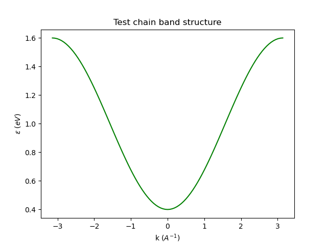

# tight-binder
## Introduction
General purpose tight-binding code for electronic structure calculations based on the Slater-Koster approximation.
The code is yet to be finished: so far the modules include the strictly necessary routines to compute band structures
without additional information. 
It is designed to allow band structure calculations of alloys up to two atomic species (provided one gives the corresponding SK amplitudes).

The idea behind the program is to allow calculations simply using the configuration file, without any need to fiddle with the code (although that option is always available).
Some examples are provided (cube.txt, chain.txt) which show the parameters needed to run a simulation.

* Last Update: Added spin-orbit coupling up to d orbitals

## Installation
Usage of a **virtual environment** is recommended to avoid conflicts, specially since this package is still in development so
it will experiment changes periodically.

* From within the root folder of the repository, install the required packages:
```
cd {path}/tightbinder
pip install -r requirements.txt
```
* Then install the tightbinder package
``` 
pip install .
```
* You can use the application from within the repository, using the ```bin/app.py``` program in the following fashion:
``` 
python bin/app.py {config_file} 
```
Or since the library is installed, create your own scripts. For now, usage of the ```app.py``` program is advised.

## Examples
The folder ```examples/``` contains some basic cases to test that the program is working correcly.
* One-dimensional chain (1 orbital)



## Workroad
The future updates will be:
- [x] hamiltonian.py: Module for inititializing and solving the Hamiltonian of the system given in the config. file
- [ ] topology.py: This module will include routines for computing topological invariants of the system
- [ ] disorder.py: Module with routines to introduce disorder in the system such as vacancies or impurities


A working GUI might be done in the future
