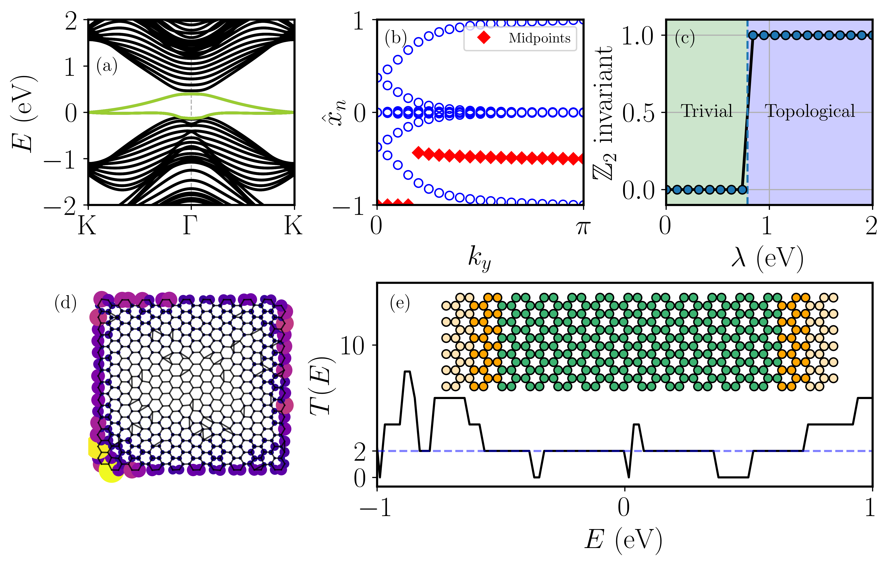

<div align="center">
  
  
  [](https://tightbinder.readthedocs.io/en/latest/?badge=latest)
  [](https://github.com/alejandrojuria/tightbinder/issues)
  [](https://www.gnu.org/licenses/gpl-3.0)
  
  
</div>

tightbinder is a Python library for electronic structure calculations based on the Slater-Koster approximation for tight-binding models. It provides all the necessary tools to build, 
modify and characterize any crystalline or disordered material.

The construction of a Slater-Koster model relies on the definition of a configuration file, which contains all the information needed to build the model.
Namely, one has to specify completely the crystalline structure, i.e. the Bravais vectors and motif, and the electronic structure which amounts to the
orbitals, onsite energies and hoppings between orbitals. The configuration file then fully characterizes the Slater-Koster models and constitutes the starting point for the majority of the calculations done
with the library. Alternatively, it is also possible to define custom models that can still leverage the capabilities of the package. 

Some of the features of the library are:
* Construction of Slater-Koster tight-binding models up to $d$ orbitals, with intraatomic spin-orbit coupling.
* Methods to modify the system as desired: construction of supercells, finite systems, introduction of vacancies or impurities, amorphization of the lattice,
  application of electric or magnetic fields.
* Complete topological characterization of materials: evolution of Wannier charge centers, $\mathbb{Z}_2$ invariant, Chern number and marker, and spatial entanglement spectrum.
* Transport calculations in two-terminal devices based on the Landauer-Buttiker formalism.
* Computation of observables such as the band structure, expected value of the spin components, density of states or local density of states, as well as the plotting routines for
  the corresponding quantities.
* Predefined models (e.g. Haldane or BHZ) and ability to define custom ones.



For a complete description of the capabilities of the package, we refer to the [documentation](https://tightbinder.readthedocs.io/en/latest/) where several usage examples can be found together with the full API 
reference.


## Installation

Usage of a **virtual environment** is recommended in general to avoid conflicts between packages.

To install the latest version of the package, simply run:
```bash
pip install tightbinder
```

Alternatively, you can clone the repository to get the most up-to-date version of the package. 
```
git clone https://github.com/alejandrojuria/tightbinder.git
```

From the root folder of the repository, install the required dependencies and then the library itself:
```
cd {path}/tightbinder
pip install -r requirements.txt
pip install .
```

## Documentation
The documentation can be accessed [online](https://tightbinder.readthedocs.io/en/latest/). To build it, you must have installed GNU Make previously. 
To do so, ```cd docs/source``` and run ```make html```. The documentation will then be created in ```docs/build/html```. It can be accessed through ```index.html```.

## Contributing
The library is still under development as new features and optimizations are added. Therefore, any kind of contribution is welcome, from completing the documentation, bug fixing, adding new features or reporting bugs of the library.
In general, any contribution should stick to the [PEP style guidelines](https://peps.python.org/pep-0008/). If in doubt, do not hesitate to contact!


