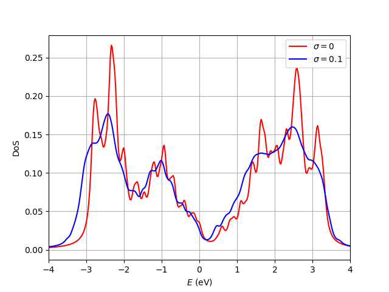

Amorphization of a Slater-Koster model
==========================================

In some cases, we might be interested in introducing structural disorder in a Slater-Koster model 
that we have previously defined. To do so, the library provides an additional class named 
:class:`tightbinder.models.AmorphousSlaterKoster`, which extends :class:`tightbinder.models.SlaterKoster` 
such that hoppings are modified according to the distance with respect to the reference (crystalline) positions.
Here we showcase this class, and use it to compare the density of states of the crystalline and slightly disordered crystal.

.. code-block:: python
    :caption: amorphous_slater_koster.py 

    # In this script we show how to create an AmorphousSlaterKoster model, and to use it
    # to compare the density of states at different disorder values

    from tightbinder.models import AmorphousSlaterKoster
    from tightbinder.disorder import amorphize
    from tightbinder.observables import dos
    from tightbinder.fileparse import parse_config_file
    import matplotlib.pyplot as plt
    import numpy as np
    from pathlib import Path

    def main():

        # Parameters of the calculation
        ncells = 12
        dos_npoints = 1000
        delta = 0.08
        disorder = 0.1

        # Parse configuration file
        path = Path(__file__).parent / ".." / "examples" / "inputs" / "Bi111.yaml"
        config = parse_config_file(path)

        # Init. model and construct supercell
        first_neighbour_distance = np.linalg.norm(config["Motif"][1][:3])
        cutoff = first_neighbour_distance * 1.4
        
        model = AmorphousSlaterKoster(config, r=cutoff).supercell(n1=ncells, n2=ncells)
        model.decay_amplitude = 1

        # Compute density of states for the crystalline system
        model.initialize_hamiltonian(override_bond_lengths=True)
        results_crystalline = model.solve()
        results_crystalline.rescale_bands_to_fermi_level()
        
        dos_crystalline, energies_crystalline = dos(results_crystalline, delta=delta, npoints=dos_npoints)

        # Disorder system and compute density of states
        model = amorphize(model, disorder)
        model.initialize_hamiltonian()
        results_amorphous = model.solve()
        results_amorphous.rescale_bands_to_fermi_level()
        dos_amorphous, energies_amorphous = dos(results_amorphous, delta=delta, npoints=dos_npoints)

        # Plot both densities of states
        fig, ax = plt.subplots(1, 1)
        ax.plot(energies_crystalline, dos_crystalline, 'r-', label=r"$\sigma=0$")
        ax.plot(energies_amorphous, dos_amorphous, "b-", label=r"$\sigma=0.1$")
        ax.set_xlabel(r"$E$ (eV)")
        ax.set_ylabel("DoS")
        ax.grid("on")
        ax.legend()
        ax.set_xlim([-4, 4])

    if __name__ == "__main__":
        main()
        plt.show()

This produces the following plot:

