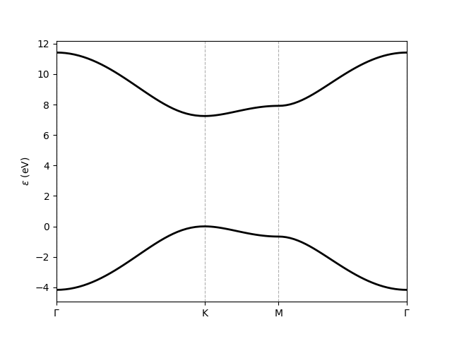

Band structure from configuration file
=================================================

.. code-block:: python
    :caption: band_structure.py

    # Script to obtain and plot the band structure of a Slater-Koster model for hBN.
    # To be executed from the root of the repository.

    from tightbinder.models import SlaterKoster
    from tightbinder.fileparse import parse_config_file
    import matplotlib.pyplot as plt
    from pathlib import Path

    def main():

        # Open and read configuration file
        path = Path(__file__).parent / ".." / "examples" / "inputs" / "hBN.yaml"
        config = parse_config_file(path)

        # Initialize model
        model = SlaterKoster(config)

        # Generate reciprocal path to evaluate the bands
        nk = 100
        labels = config["SymmetryPoints"]
        kpoints = model.high_symmetry_path(nk, labels)

        # Initialize and solve Bloch Hamiltonian
        model.initialize_hamiltonian()
        results = model.solve(kpoints)

        # Plot band structure
        results.plot_along_path(labels)

    if __name__ == "__main__":
        main()
        plt.show()
    
Executing this script results in the following plot:

