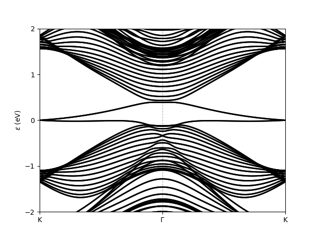

Band structure of a ribbon
=================================================

The following script shows how to generate a ribbon of a given material, i.e. how to reduce the dimensionality of the system along 
one specified direction, and obtain the bands of the new system. Note that here, for Bi(111) which has a honeycomb lattice, the generated 
ribbon is not rectangular but has diamond shape. To generate a rectangular ribbon, one can use instead the method :meth:`tightbinder.system.System.ribbon`,
which is specific to honeycomb lattices.

.. code-block:: python
    :caption: bands_ribbon_bi111.py

    from tightbinder.models import SlaterKoster
    from tightbinder.fileparse import parse_config_file
    import matplotlib.pyplot as plt

    def main():

        # Parse configuration file
        file = open("./examples/Bi111.txt", "r")
        config = parse_config_file(file)

        # Init. model and consider a finite supercell along one Bravais vector
        width = 15
        model = SlaterKoster(config).reduce(n1=width)

        # Create k point mesh
        nk = 100
        labels = ["K", "G", "K"]
        kpoints = model.high_symmetry_path(nk, labels)

        # Initialize Bloch Hamiltonian and obtain the band structure
        model.initialize_hamiltonian()
        results = model.solve(kpoints)
        
        # Plot bands of the ribbon; restrict energy window to [-2, 2] interval.
        results.plot_along_path(labels, e_values=[-2, 2])

    if __name__ == "__main__":
        main()
        plt.show()
    
Executing this script results in the following plot:

