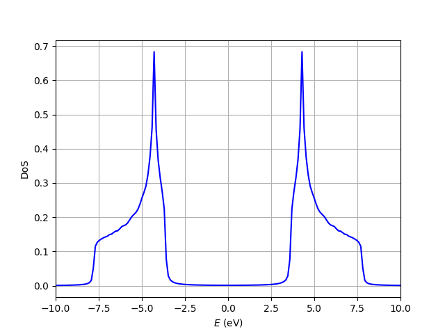

Density of states
=============================

From the band structure one can compute the density of states of the system. To be well-defined, we have to solve
the Bloch Hamiltonian not only over a high symmetry path but over the whole Brillouin zone. After meshing
the BZ and computing the DoS, we can check that it is properly normalized; we set it so that the integral 
over all energies is the number of bands:

.. math::

    \int \rho(E) dE = N_{bands}

.. code-block:: python
    :caption: density_states.py

    from tightbinder.models import SlaterKoster
    from tightbinder.fileparse import parse_config_file
    from tightbinder.observables import dos
    import matplotlib.pyplot as plt
    import numpy as np
    from pathlib import Path

    def main():
        
        # Parse configuration file and init. model
        path = Path(__file__).parent / ".." / "examples" / "inputs" / "hBN.yaml"
        config = parse_config_file(path)
        model = SlaterKoster(config)

        # Create k point mesh of the Brillouin zone
        nk = 100
        kpoints = model.brillouin_zone_mesh([nk, nk])

        # Solve bands at each kpoint
        model.initialize_hamiltonian()
        results = model.solve(kpoints)

        # Compute density of states
        density, energies = dos(results, delta=0.05, npoints=200)
        
        # Plot DoS
        fig, ax = plt.subplots(1, 1)
        ax.plot(energies, density, "b-")
        ax.set_ylabel(r"DoS")
        ax.set_xlabel(r"$E$ (eV)")
        ax.grid("on")
        ax.set_xlim([-10, 10])

        # Check normalization
        area = np.trapz(density, energies)
        print(f"Area: {area:.4f}")


    if __name__ == "__main__":
        main()
        plt.show()


Which produces the next plot:



And the following output in terminal: ```Area: 1.9993```