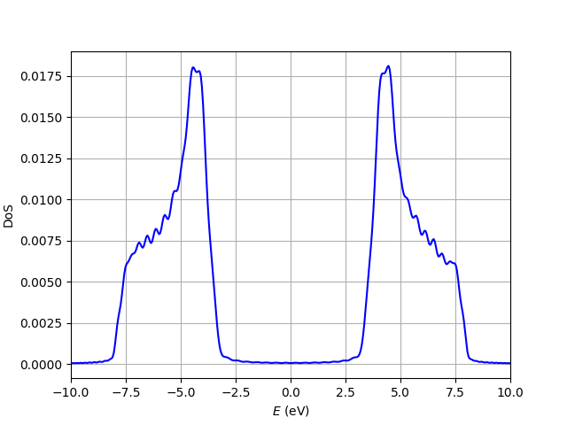

Density of states using the KPM
=====================================

For systems without translational symmetry, where we consider a supercell big enough to describe properly the system,
it might be convenient to obtain the density of states using the kernel polynomial method. This method allows to compute
the DoS without having to diagonalize previously the Hamiltonian, which is the standard way to compute the DoS.

.. code-block:: python
    :caption: density_states_kpm.py

    from tightbinder.models import SlaterKoster
    from tightbinder.fileparse import parse_config_file
    from tightbinder.observables import dos_kpm
    import matplotlib.pyplot as plt
    import numpy as np
    from pathlib import Path

    def main():
        
        # Set seed for reproducibility
        np.random.seed(1)

        # Parse configuration file and init. model
        path = Path(__file__).parent / ".." / "examples" / "inputs" / "hBN.yaml"
        config = parse_config_file(path)

        ncells = 25
        model = SlaterKoster(config).supercell(n1=ncells, n2=ncells)

        # KPM is intended to be used with sparse matrices.
        # With this the Hamiltonian is stored as a sparse matrix.
        model.matrix_type = "sparse"
        model.initialize_hamiltonian()

        # The density of states computed with the KPM uses the Hamiltonian directly,
        # without need to diagonalize the system first.
        density, energies = dos_kpm(model, nmoments=150, npoints=400, r=30)
        
        # Plot DoS
        fig, ax = plt.subplots(1, 1)
        ax.plot(energies, density, "b-")
        ax.set_ylabel(r"DoS")
        ax.set_xlabel(r"$E$ (eV)")
        ax.grid("on")
        ax.set_xlim([-10, 10])

        # Check normalization
        area = np.trapz(density, energies)
        print(f"Area: {area:.4f}")

    if __name__ == "__main__":
        main()
        plt.show()

Note that this script will take some seconds to execute since we are considering a system with hundreds of atoms. The density of states is:

.. note::
    For the KPM, the Hamiltonian should be stored in a sparse matrix as it allows faster computation. This can be specified before the Hamiltonian 
    is computed, setting the attribute :attr:`tightbinder.system.System.matrix_type` to ``'sparse'``. If the Hamiltonian is stored as a dense matrix
    (default behaviour), then a warning message will appear informing of the slower performance.

.. warning::
    The density of states obtained with the KPM is not normalized as it can be checked from the output of the script. The user should normalize 
    the density of states after it has been obtained setting its integral to the number of states of the system (dimension of the Hamiltonian).
    This can be done for instance with the ``np.trapz`` routine from NumPy.

