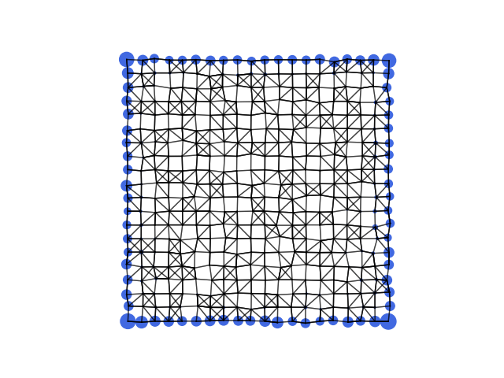

Visualization of an edge state
====================================

.. code-block:: python
    :caption: edge_state.py

    from tightbinder.models import WilsonAmorphous
    from tightbinder.result import State
    from tightbinder.disorder import amorphize
    import matplotlib.pyplot as plt
    import numpy as np

    def main():

        # Declaration of parameters of the model
        np.random.seed(1)
        m = 4
        cutoff = 1.4
        disorder = 0.2
        ncells = 20

        # Init. model, create supercell with OBC and amorphize
        model = WilsonAmorphous(m=m, r=cutoff).reduce(n1=ncells, n2=ncells)
        model = amorphize(model, disorder)

        # Obtain the eigenstates of the system
        model.initialize_hamiltonian()
        results = model.solve()

        # Identify a edge state (zero mode) of the system
        state_index = np.argmin(np.abs(results.eigen_energy))
        edge_state = State(results.eigen_states[0][:, state_index], model)

        # Plot real-space probability density
        fig, ax = plt.subplots(1, 1)
        edge_state.plot_amplitude(ax=ax)

    if __name__ == "__main__":
        main()
        plt.show()

The real-space probability density associated to the edge state is:

