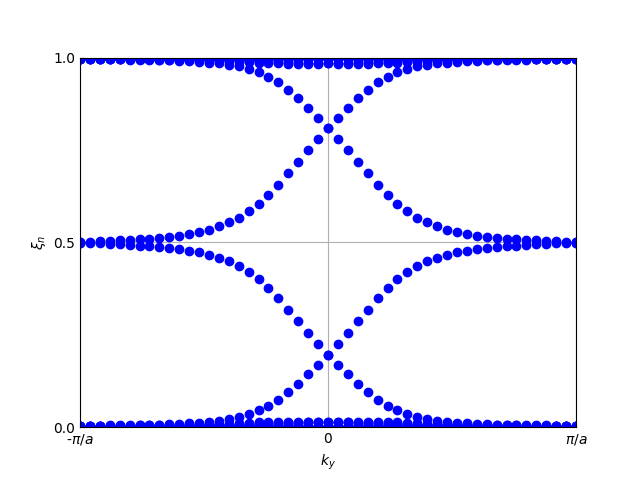

Entanglement spectrum from a spatial partition of the system
============================================================

The spatial entanglement spectrum also serves as a probe of topological behaviour of materials.
To compute it, first we need to define a plane which defines the two partitions of the system.
The entanglement spectrum is then the eigenvalues of the one-particle density matrix restricted to 
one of the partitions of the system.

.. code-block:: python
    :caption: entanglement_spectrum.py

    from tightbinder.models import SlaterKoster
    from tightbinder.fileparse import parse_config_file
    from tightbinder.topology import specify_partition_plane, entanglement_spectrum, plot_entanglement_spectrum
    import matplotlib.pyplot as plt
    import numpy as np

    def main():

        # Parse configuration file
        file = open("./examples/Bi111.txt", "r")
        config = parse_config_file(file)

        # Init. model and build ribbon
        width = 7
        model = SlaterKoster(config).reduce(n1=width)
        
        # Declare the plane which defines the partitions for the entanglement spectrum
        plane = [0, 1, 0, np.max(model.motif[:, 1])/2]
        partition = specify_partition_plane(model, plane)

        # Generate k points
        nk = 50
        labels = ["K", "G", "K"]
        kpoints = model.high_symmetry_path(nk, labels)

        # Compute the entanglement spectrum as a function of k
        model.initialize_hamiltonian()
        es = entanglement_spectrum(model, partition, kpoints)

        # Plot the spectrum
        fig, ax = plt.subplots(1, 1)
        plot_entanglement_spectrum(es, model, ax=ax)
        ax.grid("on")

    if __name__ == "__main__":
        main()
        plt.show()

    
The entanglement spectrum is:

