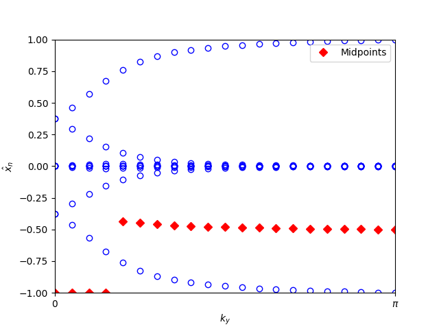

Z2 invariant from evolution of Wannier charge centers
=======================================================

.. code-block:: python
    :caption: wannier_charge_bi111.py

    from tightbinder.models import SlaterKoster
    from tightbinder.fileparse import parse_config_file
    from tightbinder.topology import calculate_wannier_centre_flow, plot_wannier_centre_flow, calculate_z2_invariant
    import matplotlib.pyplot as plt

    def main():

        # Parse configuration file
        file = open("./examples/Bi111.txt", "r")
        config = parse_config_file(file)

        # Init. model and Hamiltonian
        model = SlaterKoster(config)
        model.initialize_hamiltonian()

        # Compute Wannier charge centre evolution
        nk = 20
        wcc = calculate_wannier_centre_flow(model, nk, refine_mesh=False)

        # Plot evolution of the charge centers and compute the Z2 invariant
        plot_wannier_centre_flow(wcc)
        print(f"Z2 invariant: {calculate_z2_invariant(wcc)}")

    if __name__ == "__main__":
        main()
        plt.show()

This code should produce the following plot:

And the following output:

.. code-block::

    Z2 invariant: 1

