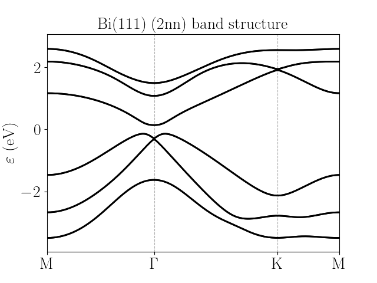
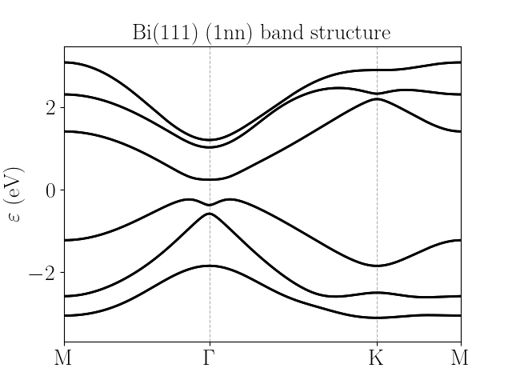

Bi(111)
=========================

The model for Bi(111) is made of :math:`s,\ p_x,\ p_y,\ p_z` orbitals, and actually uses the Slater-Koster parameters from a bulk description of Bi [Liu1995]_. This model also includes spin-orbit coupling, which is necessary to
produce the band inversion and so describe a 2d time-reversal topological insulator [Murakami2006]_. This material is described by a honeycomb lattice such that each sublattice is located at a different height :math:`z`. In principle the model includes
hoppings up to second neighbours, which are required to obtain the gap correctly, although the topological behaviour can be obtained also considering with first-neighbour hoppings only. Here we provide two configuration files, one 
with hoppings up to second-neighbours, and the other one with first-neighbour hoppings.

* Bi(111) with hoppings up to second neighbours

The band structure is:

Do note that the model has more bands than those showed; however the relevant ones are the ones close to the Fermi energy.

The configuration file is:

.. code-block::
    :caption: examples/Bi111_2nn.txt

    SystemName: Bi(111) (2nn)
    Dimensions: 2
    Lattice: 
    - [3.92587,  2.2666, 0.0]
    - [3.92587, -2.2666, 0.0]
    Species: [Bi]
    Motif:
    - [0, 0, 0, 0]
    - [2.61724, 0, -1.585, 0]
    Filling: [5]
    Orbitals: [s px py pz]
    OnsiteEnergy:
    - [-10.906, -0.486, -0.486, -0.486]
    SKAmplitudes: 
    - (0, 0, 1) -0.608 1.320 1.854 -0.600
    - (0, 0, 2)  0.0 0.0 0.156 0.0
    Spin: True
    SOC: [1.5]
    Mesh: [200, 200]
    SymmetryPoints: M G K M 

* Bi(111) with hoppings up to first neighbours

The band structure is:

The configuration file is:

.. code-block::
    :caption: examples/Bi111.txt

    SystemName: Bi(111) (1nn)
    Dimensions: 2
    Lattice: 
    - [3.92587,  2.2666, 0.0]
    - [3.92587, -2.2666, 0.0]
    Species: Bi
    Motif:
    - [0, 0, 0, 0]
    - [2.61724, 0, -1.585, 0]
    Filling: 5
    Orbitals: [s px py pz]
    OnsiteEnergy:
    - [-10.906, -0.486, -0.486, -0.486]
    SKAmplitudes: 
    - (0, 0, 1) -0.608 1.320 1.854 -0.600
    Spin: True
    SOC: 1.5
    Mesh: [200, 200]
    SymmetryPoints: M G K M 

.. [Liu1995] Electronic structure of the semimetals Bi and Sb, Yi Liu and Roland E. Allen, Phys. Rev. B 52, 1566 (1995)
.. [Murakami2006] Quantum Spin Hall Effect and Enhanced Magnetic Response by Spin-Orbit Coupling, Shuichi Murakami, Phys. Rev. Lett. 97, 236805 (2006)

