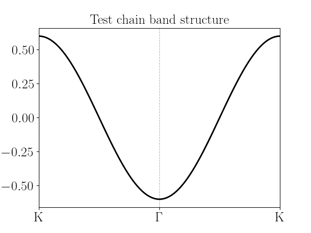

Hydrogen chain
=========================
One of the simplest models to check that the code is working properly. We consider a linear chain of atoms with :math:`s` orbitals only. Do note that the SK amplitude used for these s orbitals does not actually correspond
to any hydrogen calculation. The band structure can be obtained analitically in this case:

.. math::

    \varepsilon(k) = \varepsilon_0 - 2t\cos{ka}

where :math:`\varepsilon_0` is the onsite energy, and :math:`t` the hopping amplitude (amplitude for :math:`s` orbital in the SK context).
The band structure as obtained with the configuration file is:

Note that we need to include spin in the model to achieve half-filling; if we were to consider only one orbital (spinless) then the resulting system would have to be either empty of full, since the number of electrons
per unit cell must be an integer. The configuration file is:

.. code-block::
    :caption: examples/chain.txt

    SystemName: Test chain
    Dimensions: 1
    Lattice: 
    - [1.0, 0.0, 0.0]
    Species: H
    Motif:
    - [0.0, 0.0, 0.0, 0]
    Filling: 1
    Orbitals: s
    OnsiteEnergy:
    - 1
    SKAmplitudes: 
    - (0, 0) -0.3
    Spin: True
    SOC: 0
    Mesh: 200
    SymmetryPoints: K G K

