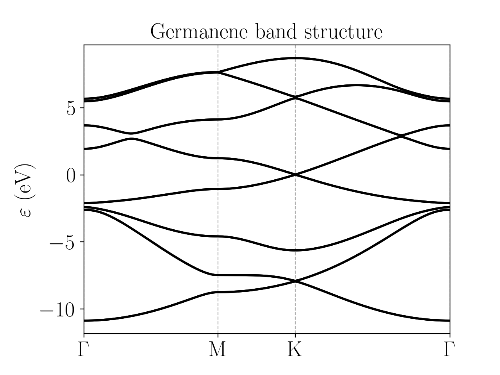

Germanene
=========================

Germanene is a material analog to graphene, but with germanium atoms instead of carbon. The structure is also buckled (meaning that each atom of the motif lies on a different :math:`z` plane).
The Slater-Koster model used here consists of :math:`s, p_x, p_y, p_z` orbitals, and also includes spin-orbit coupling [Hattori2017]_. The electronic band structure of germanene is:

The corresponding configuration file:

.. code-block::
    :caption: examples/germanene.txt

    SystemName: Germanene
    Dimensions: 2
    Lattice: 
      - [3.48142212,  2.01, 0.0]
      - [3.48142212, -2.01, 0.0]
    Species: Ge
    Motif:
      - [0, 0, 0, 0]
      - [2.3209481, 0, -0.687496, 0]
    Filling: 4
    Orbitals: [s px py pz]
    OnsiteEnergy:
      - [-7.9, -1.16, -1.16, -1.16]
    SKAmplitudes: 
      - (0, 0) -1.79 2.36 4.15 -1.04
    Spin: True
    SOC: 0.294
    Mesh: [200, 200]
    SymmetryPoints: G M K G