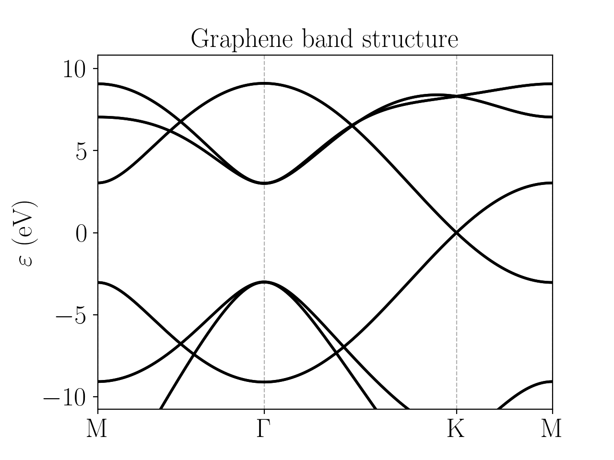

Graphene
=========================
The model for graphene consists on a Slater-Koster model based on :math:`s, p_x, p_y, p_z` orbitals, instead of using the usual minimal description based exclusively on :math:`p_z` orbitals, as in :math:`\text{hBN}`.
The model parameters are taken from [Hattori2017]_.

The band structure is:

The configuration file is:

.. code-block::
    :caption: examples/graphene.txt

    SystemName: Graphene
    Dimensions: 2
    Lattice: 
      - [2.1304,  1.23, 0.0]
      - [2.1304, -1.23, 0.0]
    Species: C
    Motif:
      - [0, 0, 0, 0]
      - [1.4203, 0, 0, 0]
    Filling: 4
    Orbitals: [s px py pz]
    OnsiteEnergy:
      - [-17.52, -8.97, -8.97, -8.97]
    SKAmplitudes: 
      - (0, 0) -6.769 5.580 5.037 -3.033 
    Spin: True
    SOC: 0.027
    Mesh: [200, 200]
    SymmetryPoints: M G K M

.. [Hattori2017] Ayami Hattori et al, Edge states of hydrogen terminated monolayer materials: silicene, germanene and stanene ribbons, J. Phys.: Condens. Matter 29 115302 (2017)

