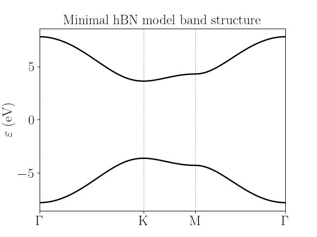

hBN 
=========================

The model for hexagonal boron nitride is a minimal one, based on :math:`p_z` orbitals exclusively with hoppings between first neighbours only [Galvani2016]_. The resulting band structure is the following:

The configuration file for the model is:

.. code-block::
    :caption: examples/hBN.txt

    SystemName: hBN
    Dimensions: 2
    Lattice: 
      - [2.16506,  1.25,  0.0]
      - [2.16506, -1.25,  0.0]
    Species: [B, "N"]
    Motif:
      - [0,  0,  0,  0]
      - [1.443376,  0,  0,  1]
    Filling: [0.5, 0.5]
    Orbitals: [s, s]
    OnsiteEnergy:
      -  3.625
      - -3.625
    SKAmplitudes: 
      - (0, 1) -2.3
    Spin: False
    SOC: [0, 0]
    Mesh: [100, 100]
    SymmetryPoints: G K M G

.. [Galvani2016] Excitons in boron nitride single layer, Thomas Galvani, Fulvio Paleari, Henrique P. C. Miranda, Alejandro Molina-Sánchez, Ludger Wirtz, Sylvain Latil, Hakim Amara, and François Ducastelle, Phys. Rev. B 94, 125303 (2016), https://doi.org/10.1103/PhysRevB.94.125303