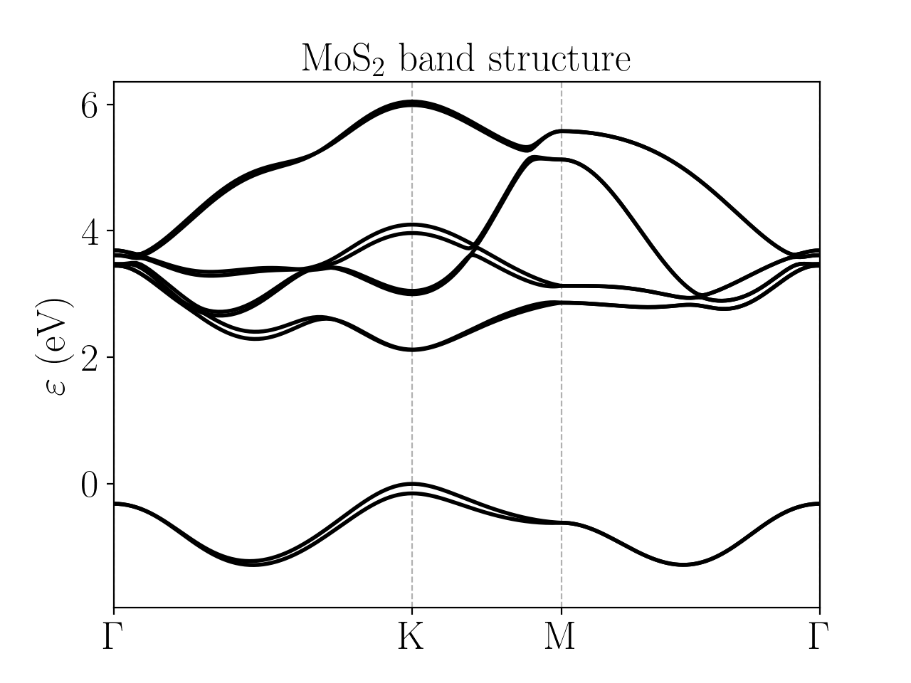
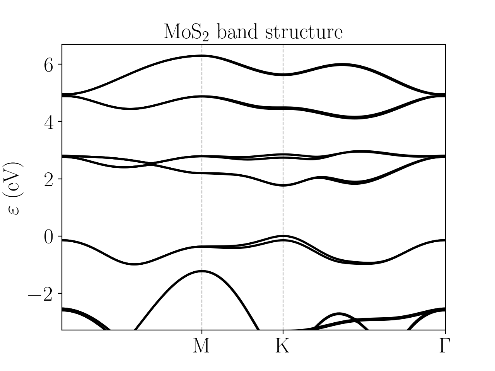

MoS2
=========================
To describe :math:`\text{MoS}_2` we use a Slater-Koster model consisting of :math:`d_{xy}, d_{xz}, d_{yz}, d_{x^2-y^2}, d_{3z^2-r^2}` orbitals for the :math:`\text{Mo}` atom, and :math:`p_x, p_y, p_z` orbitals for
the :math:`\text{S}` atoms. The model also includes spin-orbit coupling, which produces a splitting of around 100 meV of the valence band at the :math:`K` point. The crystal can
be regarded as a honeycomb lattice, although it is non planar since each atom of the unit cell lies in a different plane, following the order :math:`\text{S}-\text{Mo}-\text{S}`. The model includes
hoppings between the same and different chemical species, :math:`\text{Mo}-\text{Mo}`, :math:`\text{S}-\text{S}` and :math:`\text{Mo}-\text{S}`, up to first neighbours in all cases. Depending on how the SK parameters were fitted
to the DFT bands, the resulting model can vary. We show two different SK models for MoS:math:`_2` [Ridolfi2015]_ [Silva-Guillén2016]_.

* Model [Ridolfi2015]_

The band structure is:

Do note that the model has more bands than those showed; however the relevant ones are the ones close to the Fermi energy. This model provides a good fit 
of the first 6 conduction bands and the two first valence bands; the rest of them can be considered unphysical.

The configuration file is:

.. code-block::
    :caption: examples/MoS2_Ridolfi.txt

    SystemName: MoS2
    Dimensions: 2
    Lattice: 
    - [3.16, 0.0, 0.0]
    - [1.58, 2.73664, 0.0]
    Species: [Mo, S]
    Motif:
    - [0, 0, 0, 0]
    - [0.0, 1.8246186736331629,  1.5683120530778172, 1]
    - [0.0, 1.8246186736331629, -1.5683120530778172, 1]
    Filling: [6, 4]
    Orbitals: 
    - dxy dyz dzx dx2-y2 d3z2-r2
    - px py pz
    OnsiteEnergy:
    - [-0.352, -1.563, -1.563, -0.352, 0.201]
    - [-54.839, -54.839, -39.275]
    SKAmplitudes: 
    - (0, 0; 1) -1.153 0.612 0.086
    - (0, 1; 1) -9.880 4.196
    - (1, 1; 1) 12.734 -2.175
    Spin: True
    SOC: [0.1125, 0.078]
    Radius: 3.16
    Mesh: [200, 200]
    SymmetryPoints: G K M G

* Model [Silva-Guillén2016]_

The band structure is:

There are less conduction bands in this model compared with the previous model, but instead all the valence bands have been fitted to the DFT calculation so
they can be regarded as physical.

The configuration file is:

.. code-block::
    :caption: examples/MoS2_Silva.txt

    SystemName: MoS2
    Dimensions: 2
    Lattice: 
    - [3.16, 0.0, 0.0]
    - [1.58, 2.73664, 0.0]
    Species: [Mo, S]
    Motif:
    - [0, 0, 0, 0]
    - [0.0, 1.8244,  1.586, 1]
    - [0.0, 1.8244, -1.586, 1]
    Filling: [6, 4]
    Orbitals: 
    - dxy dyz dzx dx2-y2 d3z2-r2
    - px py pz
    OnsiteEnergy:
    - [-1.511, -0.050, -0.050, -1.511, -1.094]
    - [-3.559, -3.559, -6.886]
    SKAmplitudes: 
    - (0, 0; 1) -0.895 0.252 0.228
    - (0, 1; 1) 3.689 -1.241
    - (1, 1; 1) 1.225 -0.467
    Spin: True
    SOC: [0.1125, 0.078]
    Radius: 3.17
    Mesh: [200, 200]
    SymmetryPoints: G M K G

.. [Ridolfi2015] A tight-binding model for MoS2 monolayers, E Ridolfi et al, J. Phys.: Condens. Matter 27 365501 (2015)
.. [Silva-Guillén2016] Electronic Band Structure of Transition Metal Dichalcogenides from Ab Initio and Slater–Koster Tight-Binding Model, Silva-Guillén et al., Applied Sciences 6, no. 10: 284 (2016)

