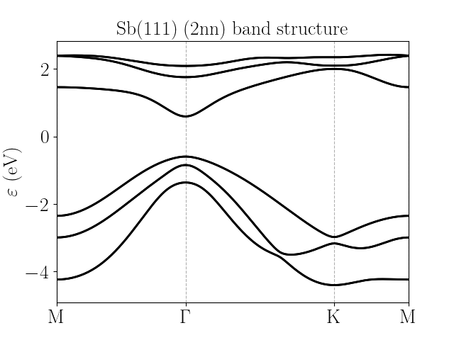
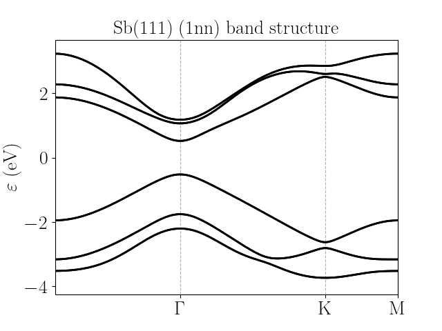

Sb(111)
=========================

Like the model for Bi(111), the Slater-Koster parametrization of Sb(111) is based on :math:`s,\ p_x,\ p_y,\ p_z` orbitals, and the resulting band structure is very similar to that of Bi(111), although the model describes
a trivial insulator instead of a topological one, even of presence of spin-orbit coupling. It is interesting to mention that if one increases the spin-orbit coupling, then the material undergoes a topological transition, similar to 
Bi(111). The SK parameters for Sb(111) are taken from [Liu1995]_, which also provides those for Bi(111). Like with bismuth, we provide two different models: one with hoppings up to second neighbours, and another one with hoppings
up to first neighbours. It should be noted that even though the two descriptions give similar behaviour, it is the second neighbour one the one which reproduces better the features from the actual DFT calculations.

* Sb(111) with hoppings up to second neighbours

The band structure is:

Do note that the model has more bands than those showed; however the relevant (and accurate) ones are the ones close to the Fermi energy.

The configuration file is:

.. code-block::
    :caption: examples/Sb111_2nn.txt

    SystemName: Sb(111) (2nn)
    Dimensions: 2
    Lattice: 
      - [3.72391,  2.15, 0.0]
      - [3.72391, -2.15, 0.0]
    Species: Sb
    Motif:
      - [0, 0, 0, 0]
      - [2.48261, 0, -1.50, 0]
    Filling: 5
    Orbitals: [s px py pz]
    OnsiteEnergy:
      - [-10.068, -0.926, -0.926, -0.926]
    SKAmplitudes: 
      - (0, 0; 1) -0.694 1.554 2.342 -0.582
      - (0, 0; 2) 0.0 0.0 0.352 0.0
    Spin: True
    SOC: 0.6
    Mesh: [200, 200]
    SymmetryPoints: M G K M 

* Sb(111) with hoppings up to first neighbours

The band structure is:

The configuration file is:

.. code-block::
    :caption: examples/Sb111.txt

    SystemName: Sb(111) (1nn)
    Dimensions: 2
    Lattice: 
      - [3.72391,  2.15, 0.0]
      - [3.72391, -2.15, 0.0]
    Species: Sb
    Motif:
      - [0, 0, 0, 0]
      - [2.48261, 0, -1.50, 0]
    Filling: 5
    Orbitals: [s px py pz]
    OnsiteEnergy:
      - [-10.068, -0.926, -0.926, -0.926]
    SKAmplitudes: 
      - (0, 0; 1) -0.694 1.554 2.342 -0.582
    Spin: True
    SOC: 0.6
    Mesh: [200, 200]
    SymmetryPoints: M G K M 