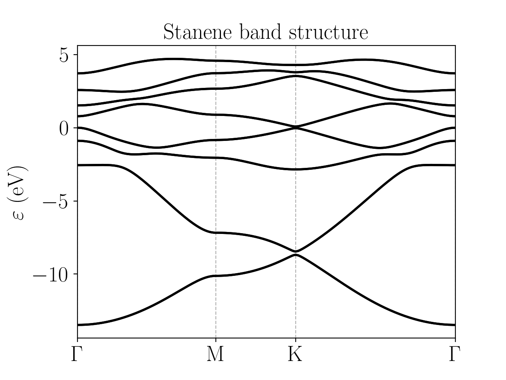

Stanene
=========================

Stanene is a two-dimensional material analogue to graphene, germanene or silicine. It consists of lead atoms on a buckled honeycomb lattice. The Slater-Koster model used for its description consists of :math:`s, p_x, p_y, p_z` orbitals together
with spin-orbit coupling, and the corresponding parameters are taken from [Hattori2017]_. The band structure obtained is:

The configuration file for this model is:

.. code-block::
    :caption: examples/stanene.txt

    SystemName: Stanene
    Dimensions: 2
    Lattice: 
      - [4.07032,  2.35, 0.0]
      - [4.07032, -2.35, 0.0]
    Species: Sn
    Motif:
      - [0, 0, 0, 0]
      - [2.713546, 0, -0.8347958, 0]
    Filling: 4
    Orbitals: [s px py pz]
    OnsiteEnergy:
      - [-9.00, -3.39, -3.39, -3.39]
    SKAmplitudes: 
      - (0, 0) -2.6245 2.6504 1.4926 -0.7877
    Spin: True
    SOC: 1.2
    Mesh: [200, 200]
    SymmetryPoints: G M K G